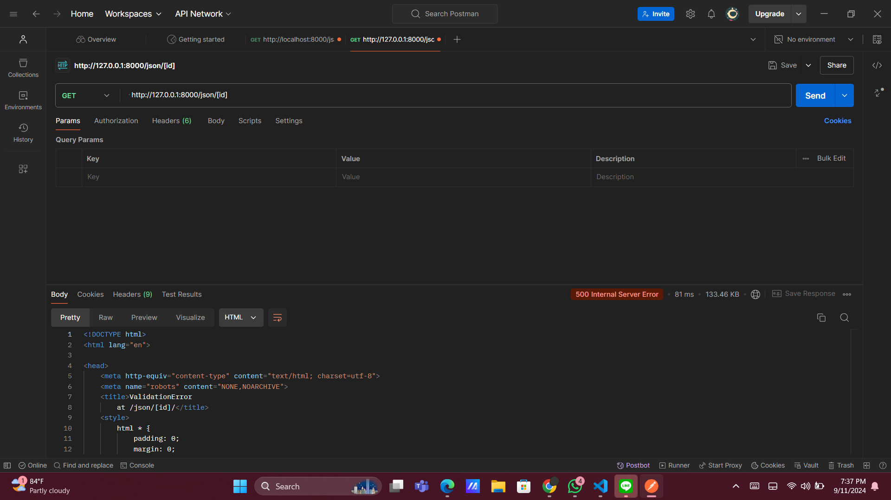

**Nama**: Widya Mutia Ichsan  
**NPM**: 2306165912  
**Kelas**: PBP E  
--- 

Aplikasi PWS yang sudah di-deploy dapat diakses melalui tautan berikut:  
[http://pbp.cs.ui.ac.id/widya.mutia/dyascommerce](http://pbp.cs.ui.ac.id/widya.mutia/dyascommerce)


***
###                  TUGAS INDIVIDU 2

### Penjelasan Implementasi Tugas *Step-by-Step* (Bukan Hanya Sekadar Mengikuti Tutorial)

**1. Membuat sebuah proyek Django baru.**  
Untuk langkah pertama saya membuat sebuah proyek Django bernama *dyascommerce* menggunakan command:  
`django-admin startproject dyascommerce`

**2. Membuat aplikasi dengan nama main pada proyek tersebut.**  
Langkah kedua yaitu membuat aplikasi baru bernama **main** di dalam proyek menggunakan perintah:  
`python manage.py startapp main`

**3. Melakukan routing pada proyek agar dapat menjalankan aplikasi main.**  
Langkah ke-3 yaitu menambahkan 'main' dan 'dyascommerce' ke dalam daftar aplikasi:  
```python
INSTALLED_APPS = [
    ...,
    'main',
    'dyas_commerce'
]
```

**4. Membuat model pada aplikasi main dengan nama Product dan memiliki atribut wajib sebagai berikut.**  
`name : CharField`  
`price : IntegerField`  
`description : TextField`  

Akan tetapi saya juga menambahkan 2 atribut yaitu:  
`stock : IntegerField`  
`category : CharField`  
<!-- `image : ImageField` -->

**5. Membuat sebuah fungsi pada `views.py` untuk dikembalikan ke dalam sebuah template HTML yang menampilkan nama aplikasi serta nama dan kelas.**<br>
Pada langkah ke-5, saya membuka berkas views.py yang terletak pada direktori main, kemudian mendeklarasikan sebuah fungsi bernama *show_main*, yang akan menerima parameter *request*. Fungsi yang saya buat ini akan mengatur permintaan HTTP dan mengembalikan tampilan yang sesuai sehingga akan mengembalikan ke dalam direktori template berisi file html yang akan menampilkan nama
    

**6. Membuat sebuah routing pada `urls.py` aplikasi main untuk memetakan fungsi yang telah dibuat pada `views.py`.**

Pada langkah ini, saya perlu membuat routing di berkas `urls.py` pada aplikasi *main* untuk menghubungkan fungsi yang sudah dibuat di `views.py`.

Langkah yang dilakukan adalah dengan menambahkan kode berikut di `urls.py` aplikasi *main*:

```python
from django.urls import path
from main.views import show_main

app_name = 'main'

urlpatterns = [
    path('', show_main, name='show_main'),
]
```

Setelah itu, saya akan menambahkan rute URL di `urls.py` proyek untuk menghubungkan aplikasi *main* dengan proyek secara keseluruhan. Pastikan membuka berkas `urls.py` di direktori proyek utama, bukan di direktori aplikasi *main*.

Impor fungsi `include` dari `django.urls`:

```python
from django.urls import path, include
```

Kemudian, saya menambahkan rute URL berikut untuk mengarahkan ke tampilan dari aplikasi *main*:

```python
urlpatterns = [
    ...
    path('', include('main.urls')),
    ...
]
```

**7. Melakukan deployment ke PWS terhadap aplikasi yang sudah dibuat sehingga nantinya dapat diakses oleh teman-temanmu melalui Internet.**<br>
Pada tahap ini, saya melakukan deploy ke PWS dengan menambahkan alamat PWS ke dalam repository menggunakan perintah:<br> 
    `git remote add pws https://pbp.cs.ui.ac.id/widya.mutia/dyascommerce.`

Selanjutnya, saya mengubah nama branch dari "master" ke "main" menggunakan perintah:<br>
    `git branch -M master.`

Setelah itu, saya melakukan push ke PWS dengan perintah 
    `git push pws master`
sehingga aplikasi saya dapat diakses oleh teman-teman melalui internet.

***

### Bagan yang Berisi Request Client ke Web Aplikasi Berbasis Django Beserta Responnya

Buat bagan yang menunjukkan alur dari request client ke web aplikasi Django dan respons yang dikembalikan. Jelaskan bagaimana `urls.py`, `views.py`, `models.py`, dan berkas `html` saling terkait dalam proses ini.


***

### Penjelasan Fungsi Git dalam Pengembangan Perangkat Lunak

Fungsi git dalam pengembangan perangkat lunak yaitu sebagai sistem kontrol yang esensial yang digunakan untuk mengelola perubahan kode secara efektif, selain itu juga memungkinkan pengembang untuk mencatat dan melacak setiap perubahan yang dilakukan pada kode sumber. Dengan Git, pengembang dapat mengatur berbagai versi aplikasi, yang sangat berguna untuk memantau perkembangan proyek dari waktu ke waktu.

Selain itu juga, dengan menggunakan Git dapat mengurangi risiko kehilangan data. Karena Git menyimpan riwayat lengkap dari setiap perubahan yang dilakukan, sehingga pengembang dapat dengan mudah kembali ke versi sebelumnya jika diperlukan. Hal ini membantu dalam memulihkan data yang mungkin hilang atau terhapus secara tidak sengaja. Dengan Git, proses pemulihan data menjadi lebih mudah dan aman, memberikan rasa percaya diri kepada pengembang bahwa kode mereka tetap terlindungi dan dapat dipulihkan jika terjadi masalah.

### Dari Semua Framework yang Ada, Mengapa Framework Django Dijadikan Permulaan Pembelajaran Pengembangan Perangkat Lunak?

Karena Django adalah framework yang populer dan banyak digunakan dalam pengembangan web. Selain itu Django memiliki fitur-fitur yang memudahkan pengembangan aplikasi web, seperti ORM dan template engine.

### Mengapa Model pada Django Disebut sebagai ORM?

Karena berfungsi sebagai jembatan antara objek-objek dalam kode Python dan tabel-tabel dalam database relasional.

---
###         TUGAS INDIVIDU 3
---
 1. mengapa kita memerlukan data delivery dalam pengimplementasian sebuah platform?

 2. mana yang lebih baik antara XML dan JSON? Mengapa JSON lebih populer dibandingkan XML?

 3. Jelaskan fungsi dari method is_valid() pada form Django dan mengapa kita membutuhkan method tersebut?

 4. Mengapa kita membutuhkan csrf_token saat membuat form di Django? Apa yang dapat terjadi jika kita tidak menambahkan csrf_token pada form Django? Bagaimana hal tersebut dapat dimanfaatkan oleh penyerang?

 5. Jelaskan bagaimana cara kamu mengimplementasikan checklist di atas secara step-by-step (bukan hanya sekadar mengikuti tutorial).

 ---
  Step 1 : Membuat input form...
  Step 2 : Menambahkan 4 fungsi views yaitu XML, JSON, XML by  ID, dan JSON by ID.
  Step 3 : Membuat routing URL 

---
### Mengakses URL XML pada Postman


### Mengakses URL JSON pada Postman


### Mengakses URL XML by ID pada Postman


### Mengakses URL JSON by ID pada Postman



